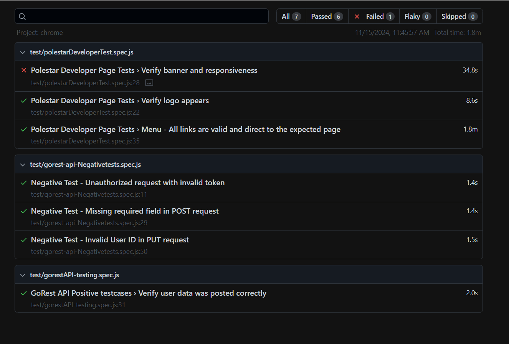
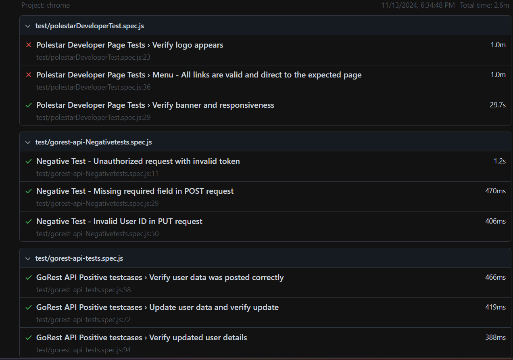

--------------------------------------------------------------------------------------------------------------

### Latest Update on UI and API Test Improvements(11/15)

-----------------------------------------------------------------------------------------------------------


As per the previous updates and instructions, I have made the following improvements to the UI and API tests:

### UI Test Improvements:
__ Playwright Locator Usage: __ I’ve tried to use Playwright locators as much as possible. However, I wasn’t able to update all locators due to some failing test cases that still need attention.

** Parallel Testing Enabled: **Initially, the test run time was 2.4 minutes for a single browser. After enabling parallel testing, the time has been reduced to approximately 1.2 minutes.


Cross-Browser Testing: I’ve enabled cross-browser testing, so tests will now run concurrently on Chrome, Firefox, and WebKit. API tests, however, will run Parallely .


** API Test Improvements:**

 -  Schema Validation and Payload Handling:* I’ve implemented schema validation and refactored the payload to load data externally, which makes the code more readable and maintainable.
API Method Tests (GET, POST, PUT, DELETE): All methods have successfully passed. One challenge is that when running the tests for seprate test cases, we need to add the user ID globally. To manage this, I used the "BeforeAll" hook, which required some configurations. I referred to the official Playwright documentation for this (link). Due to time constraints, I wasn't able to fully resolve this issue, so for now, I’ve consolidated all tests into a single test file.

### Project structure update 
```bash


├── test-results
│   ├── data
│   │   └─request_palyloads                   # Generated test result HTML report
              └─user.json
        └─response_schemas  
             └─userschemas.json
├── tests
│   ├── pages                            # Page classes for UI components following the POM pattern
│   │   └── polestarDeveloperPage.js    # Page Object for Polestar Developer Page
        └── gorestObjectPage.js 
│   ├── services                         # Service classes for API interactions
│   │   └── not updated yet              # Placeholder for future API service classes
│   ├── utils                            # Utilities and helper functions for reusable code
│   │   └──  schemasValidators.js              # Placeholder for future utility functions
│   ├── tests                            # Test scripts for both UI and API
│   │   ├── polestarDeveloperTest.js    # Test script for Polestar Developer Page (UI tests)
│   │   ├── gorest-api-tests.spec.js    # API positive and negative validation test cases
│   │   └── gorest-api-NegativeTests.spec.js  # API negative test case file for invalid scenarios
├── reports                              # Folder for test reports (HTML, screenshots)
├── playwright.config.ts                 # Playwright configuration file

```


### Test Report:
Most tests have passed successfully on my end. However, during multiple runs, I observed a few tests failing, which I believe can be improved with continuous observation and adjustments.
Some elements were difficult to locate. `For example, ` the logo text was placed in a header tag, following an anchor tag. From both an automation and accessibility perspective, this is not recommended—it should be within a button tag instead. I have corrected this in the code (please see the attached screenshot).

## Screenshot


The test failures are primarily due to timeout issues, comparing screenshot thresholds, and difficulties in locating and interacting with elements. These challenges can be easily fixed by observing behavior, but I believe further refinements can be made over time to improve stability.
Please feel free to review the updates and let me know if you need any additional details or modifications.


-----------------------------------------------------------------------------------------------------------

Previous updates and Instructions

-----------------------------------------------------------------------------------------------------------
# Playwright Automation Project

This Playwright Automation Project provides an automated testing framework for both UI and API testing. It utilizes the Page Object Model (POM) for a structured, maintainable test design.

## Description
This project automates UI tests for the Polestar Developer page("https://www.polestar.com/se/developer/get-started/") and API tests for the GoRest API("https://gorest.co.in/"), using Playwright as the test framework. The project is organized with separate modules for page elements, services, utilities, and test cases, providing a clean and modular codebase that supports responsive testing, REST API validations, and report generation. The UI tests validate page elements and responsiveness, while the API tests cover CRUD operations and both positive and negative scenarios.

## Getting Started

### System Requirements

node >= v18.5.x

npm >= v7


## Setup

* Install Visual Studio Code (or any editor)
https://code.visualstudio.com/download

* Install Node.js

https://nodejs.org/en/download

### Dependencies
Node.js (v14 or higher)
Playwright
Any compatible OS (Windows, Mac, Linux)

cd <project-folder>
### Clone the repository:

```bash
git clone https://github.com/prema46/PolestarDeveloperPage-Playwrite.git
```
Installing
```bash
npm install
npx playwright install
```

### Project structure

* Page Object Model (POM): Following the POM pattern for the UI components and API validation.
* ` Not updated yet: ` folder is For future updates, indicating that these folders and files are placeholders and will be updated later to avoid hardcoding and improve maintainability.
* Readable: Avoiding hardcoded values ensures better readability and flexibility for future changes.

```bash

├── test-results
│   ├── data
│   │   └── index.html                  # Generated test result HTML report
├── tests
│   ├── pages                            # Page classes for UI components following the POM pattern
│   │   └── polestarDeveloperPage.js    # Page Object for Polestar Developer Page
│   ├── services                         # Service classes for API interactions
│   │   └── not updated yet              # Placeholder for future API service classes
│   ├── utils                            # Utilities and helper functions for reusable code
│   │   └── not updated yet              # Placeholder for future utility functions
│   ├── tests                            # Test scripts for both UI and API
│   │   ├── polestarDeveloperTest.js    # Test script for Polestar Developer Page (UI tests)
│   │   ├── gorest-api-tests.spec.js    # API positive and negative validation test cases
│   │   └── gorest-api-NegativeTests.spec.js  # API negative test case file for invalid scenarios
├── reports                              # Folder for test reports (HTML, screenshots)
├── playwright.config.ts                 # Playwright configuration file

```
Install the dependencies:

```bash
npm install
```
### Executing Program

To run the Playwright tests, use:

```bash
npx playwright test
```
To view test results in HTML format:
```bash
`npx playwright show-report`
```
Detailed configurations for brow'ser options, viewport settings, and environment variables are managed within 
playwright.config.ts.

###  Help
If any issues arise, check the Playwright documentation or run:
```bash
`npx playwright help`
```

### Test report 
Some tests are currently failing due to timeout issues. This is caused by certain operations exceeding the default time limit. However, these tests can be resolved by adjusting the timeout settings in the test configuration and Parallel excution . This update is planned for future revisions to ensure all tests pass without issues.

## Screenshot

## Common issues:

* Ensure all dependencies are installed with npm install.
* If tests fail due to timeouts, adjust the timeout settings in playwright.config.ts.
