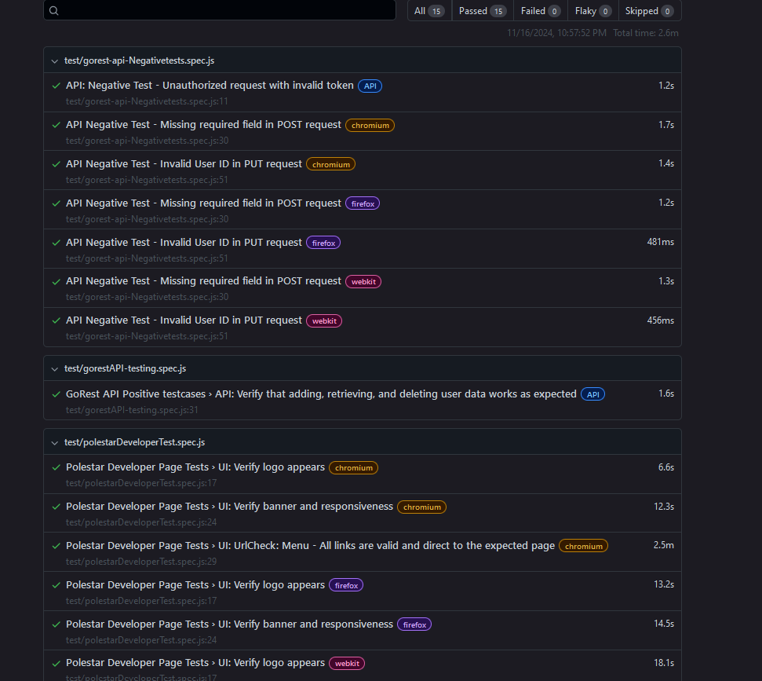

# Playwright Automation Project

This Playwright Automation Project provides an automated testing framework for both UI and API testing. It utilizes the Page Object Model (POM) for a structured, maintainable test design.

## Description
This project automates UI tests for the Polestar Developer page("https://www.polestar.com/se/developer/get-started/") and API tests for the GoRest API("https://reqres.in/"), using Playwright as the test framework. The project is organized with separate modules for page elements, services, utilities, and test cases, providing a clean and modular codebase that supports responsive testing, REST API validations, and report generation. The UI tests validate page elements and responsiveness, while the API tests cover CRUD operations and both positive and negative scenarios.

## Getting Started

### System Requirements

node >= v18.5.x

npm >= v7


## Setup

* Install Visual Studio Code (or any editor)
https://code.visualstudio.com/download

* Install Node.js

https://nodejs.org/en/download

### Dependencies
Node.js (v14 or higher)
Playwright
Any compatible OS (Windows, Mac, Linux)

cd <project-folder>
### Clone the repository:

```bash
git clone https://github.com/prema46/PolestarDeveloperPage-Playwrite.git
```
Installing
```bash
npm install
npx playwright install
```

### Project structure

* Page Object Model (POM): Following the POM pattern for the UI components and API validation.
* Readable: Avoiding hardcoded values ensures better readability and flexibility for future changes.

```bash

├── test-results
│   ├── data
│   │   ├── request_payloads
│   │   │   └── user.json
│   │   └── response_schemas
│   │       └── user_schemas.json
├── tests
│   ├── pages                             # Page classes for UI components (POM pattern)
│   │   ├── polestarDeveloperPage.js
│   │   └── gorestObjectPage.js
│   ├── services                          # API interaction classes (future updates planned)
│   ├── utils                             # Utility functions (schema validators and helpers)
│   │   └── schemaValidators.js
│   ├── tests                             # Test scripts
│   │   ├── polestarDeveloperTest.js      # UI test for Polestar Developer Page
│   │   ├── gorest-api-tests.spec.js      # Positive and negative API tests
│   │   └── gorest-api-NegativeTests.spec.js
├── reports                               # Test reports (HTML, screenshots)
├── playwright.config.ts                  # Playwright configuration
                                               # Playwright configuration file

```
Install the dependencies:

```bash
npm install
```
### Executing Program

To run the Playwright tests, use:

```bash
npx playwright test
```
To view test results in HTML format:
```bash
`npx playwright show-report`
```
Detailed configurations for brow'ser options, viewport settings, and environment variables are managed within 
playwright.config.ts.

###  Help
If any issues arise, check the Playwright documentation or run:
```bash
`npx playwright help`
```
--------------------------------------------------------------------------------------------------------

# Project Refinements

--------------------------------------------------------------------------------------------------------
## Locator Strategy:

Switched to CSS selectors for better reliability and consistency, especially in WebKit.
## Parallel Testing:

Reduced test run time from 1.6 minute (single browser) to approximately 3 minutes with parallel execution, depending on response times.

# API validation  and Cross-Browser Testing:

1. Enabled concurrent testing on Chrome, Firefox, and WebKit.
2. Configured API tests to run only once to save execution time.
3. implements Schema Validation and Payload Refactoring : Added schema validation for API responses and externalized payload data for improved readability and maintainability.
4 API Tests (GET, POST, PUT, DELETE):
  4.1 Consolidated tests into a single file using a "BeforeAll" hook to manage user ID globally.
4.2 Successfully validated both positive and negative scenarios.

# Accessibility Fixes:

Improved locators for elements like logo text misplaced within anchor tags to enhance automation and accessibility.

## Known Issues and Fixes
1. Flaky tests due to timeouts and screenshot threshold comparisons are under observation for refinement.
2. Locator challenges for specific elements have been resolved, and restructuring recommendations were implemented to improve stability.

   
## Test Reports
Most tests have passed successfully across all browsers, with significant improvements in execution time and accuracy. Parallel testing and schema validation have optimized the framework for efficiency.
### Screenshot


## Next Steps
1. Enhance API service classes in the services folder.
2. Refine flaky tests to improve reliability.
3. Fully resolve locator issues in UI tests.
4. Modularize API tests further for scalability.

